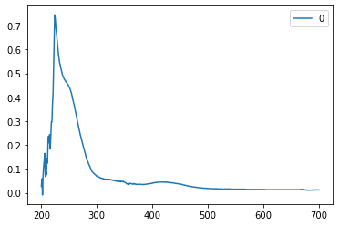
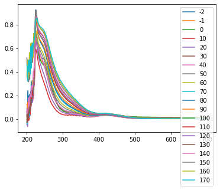
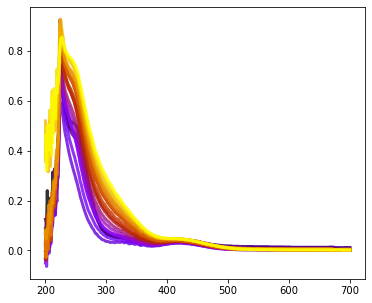
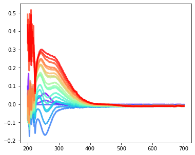
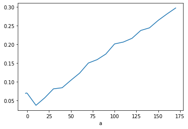

.. _theme10:

=========================================
Pandas 
=========================================

`Лекция в .ipynb формате <../../source/lectures/theme10.ipynb>`_

**Подготовлена к.х.н. Бердюгиным Семёном Николаевичем**

Pandas - открытая библиотека, предоставляющая высокпроизводительные
удобные инструменты для работы с данными. Библиотека поставляется в
стандартном наборе дистрибутива anaconda. `Ссылка на документацию <https://pandas.pydata.org/docs/index.html>`_.

Для использования ``Pandas`` импортируется в код обычным методом. По
общей договоренности чаще всего его импортируют как ``pd``.

.. code:: ipython3

    import pandas as pd

Основные классы для хранения данных в Pandas
============================================

``pd.DataFrame`` явдяется основным классом в Pandas. По логике своего
устройства каждый объект класса ``DataFrame`` является таблицей.

.. figure:: figs/theme10/01_table_dataframe1.svg

Каждая колонка, в свою очередь представляет из себя объект класса
``pd.Series``.

Создадим пустой объект ``pd.DataFrame``

.. code:: ipython3

    panob=pd.DataFrame()
    print(type(panob))

.. parsed-literal::

    <class 'pandas.core.frame.DataFrame'>

В качестве аргумента ``pd.DataFrame()`` может быть любой массив с
данными - строки, числа, списки и тд. Сделаем массив из 2 списков.
Каждая строка и колонка имеет свой индекс.

.. code:: ipython3

    datalist = ['a','b','c',1,2,3]
    panob = pd.DataFrame([datalist,datalist[:-1]])
    print([datalist,datalist[:-1]], end='\n\n\n')
    
    print('объекты DataFrame выводятся вместе с индексами.')
    print('пустые ячейки заполняются NaN\n')
    print(panob)

.. parsed-literal::

    [['a', 'b', 'c', 1, 2, 3], ['a', 'b', 'c', 1, 2]]
    
    
    объекты DataFrame выводятся вместе с индексами.
    пустые ячейки заполняются NaN
    
       0  1  2  3  4    5
    0  a  b  c  1  2  3.0
    1  a  b  c  1  2  NaN

К элементам ``pd.DataFrame`` можно обращаться по индексу и брать срезы,
как и с любыми итерируемыми объектами.

Выведем ``panob[0]`` - первую колонку созданного объекта (тип объекта
``pd.Series``)

.. code:: ipython3

    print(type(panob[0]), end='\n\n\n')
    print(panob[0], end='\n\n\n')
    
    #печатаем 0 элемент 0 элемента датафрейма, иными словами datalist[0]
    print(panob[0][0])
    
    #таким образом, в датафрейм можно загружать любые объекты, 
    #каждый объект обрабатывать согласно его свойствам

.. parsed-literal::

    <class 'pandas.core.series.Series'>
    
    
    0    a
    1    a
    Name: 0, dtype: object
    
    
    a

Именой аргумент ``index`` в ``pd.DataFrame(index=)`` позволяет присвоить
индексам свои значения

.. code:: ipython3

    import numpy as np
    
    i=pd.DataFrame([2,4,6,8,10,12])
    i_np=np.arange(1,13,2)
    datalist = ['a','b','c',1,2,3]
    panob1 = pd.DataFrame(datalist)
    print(panob1, end='\n\n\n')
    
    panob2 = pd.DataFrame(datalist,index=i_np)
    print(panob2)

.. parsed-literal::

       0
    0  a
    1  b
    2  c
    3  1
    4  2
    5  3
    
    
        0
    1   a
    3   b
    5   c
    7   1
    9   2
    11  3

Изменение DataFrame
===================

Дополнение объекта
------------------

Объекты ``DataFrame`` имеют несколько методов модификации. Для
добавления данных в таблицу можно использовать метод ``append`` или
функцию ``pd.concat``.

Создадим новую таблицу просто добавив в нее дополнительные записи

.. code:: ipython3

    panob3=panob1.append(i)#добовляем записи из i к старому panob1
    print(panob3, end='\n\n\n')
    #можно наоборот
    panob3=i.append(panob1)
    print(panob3)

.. parsed-literal::

        0
    0   a
    1   b
    2   c
    3   1
    4   2
    5   3
    0   2
    1   4
    2   6
    3   8
    4  10
    5  12
    
    
        0
    0   2
    1   4
    2   6
    3   8
    4  10
    5  12
    0   a
    1   b
    2   c
    3   1
    4   2
    5   3

Также объединения с настраиваемыми параметрами можно использовать
функцию ``pd.concat``. Мы рассмотрим только два ключевых аргумента

``objs`` - список для объединения

``axis`` - ось вдоль которой объединять (0 - допишем в конце, 1 -
добавим колонку)

пустые ячейки будут заполнены ``NaN``. Более подробное описание можно
найти в документации.

.. code:: ipython3

    panob4=pd.concat([i,panob2],axis=0)#аналогично panob3=i.append(panob2)
    
    #объединяем индексы таблиц i и panob1.
    #Появляются NaN потому что в исходных данных нет элементов
    #с соответствуюзими индексами
    panob5=pd.concat([i,panob2],axis=1)
    panob6=pd.concat([panob2,i],axis=1)
    
    print(panob4, end='\n\n\n')
    print(panob5, end='\n\n\n')
    print(panob6)

.. parsed-literal::

         0
    0    2
    1    4
    2    6
    3    8
    4   10
    5   12
    1    a
    3    b
    5    c
    7    1
    9    2
    11   3
    
    
           0    0
    0    2.0  NaN
    1    4.0    a
    2    6.0  NaN
    3    8.0    b
    4   10.0  NaN
    5   12.0    c
    7    NaN    1
    9    NaN    2
    11   NaN    3
    
    
          0     0
    0   NaN   2.0
    1     a   4.0
    2   NaN   6.0
    3     b   8.0
    4   NaN  10.0
    5     c  12.0
    7     1   NaN
    9     2   NaN
    11    3   NaN

Индексация DataFrame
--------------------

При объединении объектов мы могли случайно (или специально) поломать
индексацию. Если мы хотим восстановить стандартную нумерацию, можем
использовать метод ``.reset_index()``

.. code:: ipython3

    print(panob6,end='\n\n\n')
    print(panob6.reset_index())

.. parsed-literal::

          0     0
    0   NaN   2.0
    1     a   4.0
    2   NaN   6.0
    3     b   8.0
    4   NaN  10.0
    5     c  12.0
    7     1   NaN
    9     2   NaN
    11    3   NaN
    
    
       index    0     0
    0      0  NaN   2.0
    1      1    a   4.0
    2      2  NaN   6.0
    3      3    b   8.0
    4      4  NaN  10.0
    5      5    c  12.0
    6      7    1   NaN
    7      9    2   NaN
    8     11    3   NaN

Каждая колонка в таблице имеет свое название, по которому можно
обращаться к DataFrame. При этом возвращается соответствующая строка.

Для присвоения названий колонок во время создания фрейма используется
именной аргумент ``colunns``

.. code:: ipython3

    panob2 = pd.DataFrame(datalist,index=i_np, columns = {'a1'})
    print(panob2)

.. parsed-literal::

       a1
    1   a
    3   b
    5   c
    7   1
    9   2
    11  3

При конкатенации массивов название колонок сохраняется

.. code:: ipython3

    panob6=pd.concat([panob2,i],axis=1)
    print(panob6, end='\n\n')
    
    panob6=pd.concat([panob2,i],axis=0)
    print(panob6)

.. parsed-literal::

         a1     0
    0   NaN   2.0
    1     a   4.0
    2   NaN   6.0
    3     b   8.0
    4   NaN  10.0
    5     c  12.0
    7     1   NaN
    9     2   NaN
    11    3   NaN
    
         a1     0
    1     a   NaN
    3     b   NaN
    5     c   NaN
    7     1   NaN
    9     2   NaN
    11    3   NaN
    0   NaN   2.0
    1   NaN   4.0
    2   NaN   6.0
    3   NaN   8.0
    4   NaN  10.0
    5   NaN  12.0

Если у столбца есть название, то его можно вызвать обращаясь к аттрибуту
соответствующего объекта. Иначе используются индексы

.. code:: ipython3

    print(panob6.a1)
    print(panob6[0])

.. parsed-literal::

    1       a
    3       b
    5       c
    7       1
    9       2
    11      3
    0     NaN
    1     NaN
    2     NaN
    3     NaN
    4     NaN
    5     NaN
    Name: a1, dtype: object
    1      NaN
    3      NaN
    5      NaN
    7      NaN
    9      NaN
    11     NaN
    0      2.0
    1      4.0
    2      6.0
    3      8.0
    4     10.0
    5     12.0
    Name: 0, dtype: float64

Если требуется изменить название колонки, то можно использовать метод
``.rename``

.. code:: ipython3

    panob6=panob6.rename(columns={'a1':'a',0:'b'})
    print(panob6, end='\n\n\n')
    #теперь мы можем вызывать колонки по их названию
    print(panob6.a,'\n\n', panob6.b)

.. parsed-literal::

          a     b
    1     a   NaN
    3     b   NaN
    5     c   NaN
    7     1   NaN
    9     2   NaN
    11    3   NaN
    0   NaN   2.0
    1   NaN   4.0
    2   NaN   6.0
    3   NaN   8.0
    4   NaN  10.0
    5   NaN  12.0
    
    
    1       a
    3       b
    5       c
    7       1
    9       2
    11      3
    0     NaN
    1     NaN
    2     NaN
    3     NaN
    4     NaN
    5     NaN
    Name: a, dtype: object 
    
     1      NaN
    3      NaN
    5      NaN
    7      NaN
    9      NaN
    11     NaN
    0      2.0
    1      4.0
    2      6.0
    3      8.0
    4     10.0
    5     12.0
    Name: b, dtype: float64

Загрузка экспериментальных данных
=====================================

Для загрузки экспериментальных данных из текстовых файлов используется
функция pd.read_table(filename), которая создает объект класса
DataFrame, содержащий данные из загружаемого файла filename. Функция
содержит большое количество аргументов, которые позволяют как открыть
разноформатные данные, так и задать дополнительные параметры вашего
датафрейма.

Примечательно, что используя циклы и конкатенацию можно записать в
датафрейм сразу все файлы из папки, что зачастую бывает полезно при
обработке однотипных данных, таких как спектры.

В нашем примере мы создадим функцию ``importer`` с аргументами
``folder`` (папка с экспериментальными данными) и ``undent`` (число,
показывающее сколько символов с конца необходимо убрать из имени файла,
чтобы получить число; в дальнейшем это будет использоваться для задания
ключей).

Такая функция полезна, если названия ваших файлов состоят из числа
(например, времени в минутах с начала эксперимента, как в используемом
для примера случае).

.. code:: ipython3

    
    def importer(folder, undent):    
        items = os.listdir(folder)#Считываем имена файлов в папке
        data = pd.DataFrame()#Создаем пустой DataFrame
        
        for names in items: #Инициируем главный цикл перебора всех имен в искомой папке
            
            if names.endswith(".txt"):#Выбираем только файлы с расширением txt. 
                
                #Загружаем данные из файлов текстовых файлов
                table=pd.read_table(folder +'/' + names, # имя файла
                                    sep='\s+', #разделитель строк в исходном файле
                                    skiprows=[0],#количество или номера строк, которые не следует считывать 
                                    names=['wavelenght'+names[:-undent],int(names[:-undent])], #названия колонок, которые следует использовать при чтении из файла
                                    index_col=0)#колонка, которая будет использоваться в качестве индекса. Если не задавать - будут присвоены индексы по умолчанию, и датафрейм будет двумерным
                #Собираем все экспериментальные в один датафрейм data с помощью конкатенации массивов data и table.
                #В отличие от numpy при конкатенации dataframe нулевой размерности и непустого не возникает ошибок
                #несовпадения размерности, что значитльно упрощает жизнь. Кроме этого, как было указано раньше,
                #при несовпадении размерностей файлов, пустые ячейки будут заполнены NaN, после чего их можно будет убрать, например взяв срез
                data = pd.concat([data,table], 
                                 axis=1)#ключ, указывающий на поколоночную конкатенацию  
        return data.reindex(sorted(data.columns), axis=1)

Последняя строчка требует отдельного пояснения. Поскольку при чтении
имен файлов создается список, заполненный данными класса ``string``,
первоначальная сортировка применяется “неправильная”, и получается
массив, в котором файлы выстроены не в том порядке, в котором вы их
экспериментально получили. Одним из способв избежания этой проблемы
служит функция ``sorted`` которая по умалчанию сортирует сначала числа,
если видит их, а затем символы. Соответственно, аргументом будут служить
названия колонок нашего массива с данными ``data``, а метод ``reindex``
будет изменять порядок расположения колонок в соответсвии со вновь
остортированным списком. В итоге получим новый датафрейм, в котором
данные будут расположены в порядке возрастания их порядкового номера.

На следующем этапе воспользуемся созданной нами функцией importer. Для
этого нам понадобится импортировать библиотеку os.

`используемые файлы <../../source/lectures/theme10.zip>`_

.. code:: ipython3

    import os
    folder="theme10/"#задаем название папки с экспериментальными данными
    undent = 7 #количесвто ненужных символов в конце названия
    data = importer(folder,undent) #задаем переменной data значения функции importer c аргументами folder и udent
    print(data, '\n\n', 'получили массив с экспериментальными данными')
    
    

.. parsed-literal::

            -2     -1      0      10     20     30     40     50     60     70   \
    700.0  0.010  0.010  0.012  0.001  0.002  0.005  0.001  0.002  0.002  0.002   
    699.0  0.010  0.010  0.012  0.001  0.002  0.005  0.001  0.002  0.002  0.002   
    698.0  0.010  0.010  0.012  0.001  0.002  0.005  0.001  0.002  0.002  0.002   
    697.0  0.009  0.010  0.012  0.001  0.002  0.004  0.001  0.002  0.001  0.002   
    696.0  0.009  0.010  0.012  0.001  0.002  0.005  0.001  0.002  0.001  0.002   
    ...      ...    ...    ...    ...    ...    ...    ...    ...    ...    ...   
    204.0  0.147  0.127  0.108 -0.013  0.006  0.036  0.012  0.085  0.045  0.002   
    203.0  0.240  0.068  0.072  0.005  0.025  0.062  0.039  0.036  0.084  0.017   
    202.0  0.121  0.017 -0.009 -0.025 -0.064  0.008 -0.005  0.024  0.036 -0.011   
    201.0  0.077  0.115  0.059 -0.030  0.004  0.049 -0.002 -0.028  0.014 -0.042   
    200.0  0.087  0.125  0.027 -0.032 -0.050  0.067  0.035  0.061  0.025 -0.021   
    
             80     90     100    110    120    130    140    150    160    170  
    700.0  0.001  0.003  0.004  0.002  0.001  0.006  0.004  0.002  0.003  0.001  
    699.0  0.001  0.003  0.004  0.002  0.001  0.006  0.004  0.002  0.003  0.001  
    698.0  0.001  0.003  0.004  0.002  0.001  0.006  0.004  0.002  0.003  0.001  
    697.0  0.001  0.003  0.004  0.002  0.001  0.006  0.004  0.002  0.003  0.001  
    696.0  0.001  0.003  0.004  0.002  0.001  0.006  0.004  0.002  0.003  0.001  
    ...      ...    ...    ...    ...    ...    ...    ...    ...    ...    ...  
    204.0  0.019  0.001  0.065  0.005  0.074  0.005  0.095  0.316  0.343  0.499  
    203.0  0.019  0.142  0.076  0.070  0.091  0.082  0.071  0.482  0.504  0.413  
    202.0  0.025 -0.001  0.022 -0.023  0.037  0.034  0.068  0.369  0.456  0.321  
    201.0 -0.001  0.014  0.036  0.011  0.037 -0.029  0.046  0.352  0.452  0.439  
    200.0 -0.003  0.014 -0.027 -0.003  0.020  0.071  0.083  0.520  0.367  0.462  
    
    [501 rows x 20 columns] 
    
     получили массив с экспериментальными данными

Построение графиков из экспериментальных данных
=================================================

Теперь мы имеем 2d массив экспериментальных данных, в котором колонки
названы временем эксперимента, а строки - длиной волны. Для построения
графиков нет необходимости подключать библиотеку ``matplotlib``,
поскольку ``pandas`` автоматически ее загружает при вызове функции
``plot``. Построим сперва график одной экспериментальной кривой на
первом графике, а затем на втором - всех экспериментальных данных.

.. code:: ipython3

    data[{0}].plot()
    data.plot()

.. parsed-literal::

    <matplotlib.axes._subplots.AxesSubplot at 0x7ffac5d23a60>

Как видно на втором графике, картинки получились некаистые и непонятные.
Чтобы это исправить можно воспользоваться ключами, которые подробно
описаны в документации к функции. Они во многом похожи на те, что
используются в блиблиотеке ``matplotlib``.

Например, можно задать гамму, благодаря которой последовательные кривые
будут строиться с использованием последовательности цветов, что полезно
при визуализации данных с временным разрешением, или для того, чтобы
визуализировать плавно изменяющиеся данные.

.. code:: ipython3

    
    data.plot(cmap = 'gnuplot', #гамма из библиотеки matplotlib
              legend = False, #аргумент, указывающий на то, добавлять легенду (значение True) или  нет 'False'
              figsize=(6, 5), #аргумент, указывающий на размер картинки в дюймах
              lw = 3, #аргумент, указывающий на толщину линий, необходимо использовать только целочисленные значения
              alpha=0.8) #аргумент альфа-канала, влияет на прозрачность фона

.. parsed-literal::

    <matplotlib.axes._subplots.AxesSubplot at 0x7ffac5c320a0>

Манипуляции с данными.
=======================

Данные в датафреймах зачастую приходится обрабатывать одинаковыми
методами. Для того, чтобы не использовать циклы для перебора строк или
столбцов, полезно использовать ``lamda``-функцию, это будет наиболее
простой и лаконичный способ.

В нашем примере мы будем вычитать спектр исходного соединения,
полученного при времени t = 0 (столбец с ключом ``{0}``) из остальных
столбцов. Для начала создадим новую переменную со значениями, которые мы
будем вычитать.

.. code:: ipython3

    first_col=data[{0}]

Затем воспользуемся функцией apply для применения математической
операции ко всем колонкам

.. code:: ipython3

    bigtable_sub=data.apply(lambda column: column - first_col[0],  
                            #column взято для удобства, можно писать любое название
                            #first_col[0] необходимо повторно указать название колонки,
                            #потому что pandas требует это делать при применении оперпций к колонкам
                            axis=0)# ключ указывает, что опреацию будем применять поколоночно

Построим что получилось с теми же ключами, как и в предыдущем случае, но
в другой гамме.

.. code:: ipython3

    bigtable_sub.plot(cmap = 'rainbow', #карта цветов из библиотеки matplotlib
              legend = False, #ключ, указывающий на то, добавлять легенду (значение True) или  нет 'False'
              figsize=(6, 5), #ключ, указывающий на размер картинки в дюймах
              lw = 3, #ключ, указывающий на толщину линий, необходимо использовать только целочисленные значения
              alpha=0.8) #ключ альфа-канала, влияет на прозрачность фона

.. parsed-literal::

    <matplotlib.axes._subplots.AxesSubplot at 0x7ffac5b8bf70>

Иногда бывает необходимо взять горизонтальный срез из ``dataframe``,
например, чтобы проследить, как изменяется поглощение только на одной
длине волны. Для таких целей существует функция ``loc``, аргументом
которой служит индекс нужных элементов в массиве.

.. code:: ipython3

    data300 = data.loc[300]
    print(data300)

.. parsed-literal::

    -2      0.069
    -1      0.070
     0      0.069
     10     0.037
     20     0.057
     30     0.081
     40     0.084
     50     0.104
     60     0.123
     70     0.150
     80     0.159
     90     0.174
     100    0.201
     110    0.206
     120    0.216
     130    0.237
     140    0.244
     150    0.264
     160    0.281
     170    0.297
    Name: 300.0, dtype: float64

Эти данные можно использовать для построения кинетических кривых

.. code:: ipython3

    ax=data300.plot()
    ax.set_xlabel("Time, min") #название оси x
    ax.set_ylabel("Absorption")   #название оси y

.. parsed-literal::

    <AxesSubplot:xlabel='a'>

